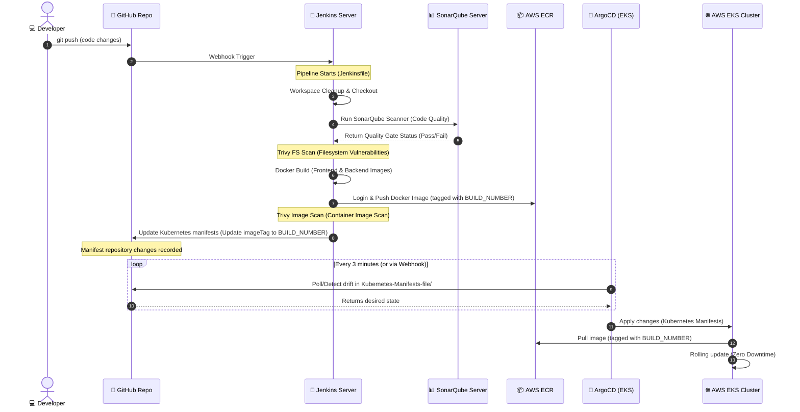

# 📐 Project Architecture & Workflow Diagrams

This page contains comprehensive, high-resolution architectural and workflow diagrams for the **Three-Tier DevSecOps** project. These diagrams illustrate the cloud infrastructure, CI/CD pipeline, and cluster-level component relationships.

---

## ☁️ 1. AWS Architecture Diagram
The infrastructure is divided into two separate Virtual Private Clouds (VPCs): one for the DevOps management and CI/CD tools, and another for the Kubernetes workloads on AWS EKS. This separation follows the principle of least privilege and network isolation.

```mermaid
flowchart TB
    classDef vpc fill:#1e1e24,stroke:#5c5c6d,stroke-width:2px,color:#fff;
    classDef subnet fill:#2d2d3a,stroke:#3b82f6,stroke-width:1px,stroke-dasharray: 5 5,color:#fff;
    classDef resource fill:#1f2937,stroke:#10b981,stroke-width:2px,color:#fff;
    classDef aws fill:#ff9900,stroke:#d97706,stroke-width:2px,color:#000;
    classDef ext fill:#4b5563,stroke:#1f2937,stroke-width:2px,color:#fff;

    %% External Clients & Domain
    Client((🖥️ End User)) :::ext
    DNS[Route 53 DNS<br/>devopswithsanket.space] :::aws

    %% Connections
    Client --> DNS
    DNS --> ALB

    subgraph VPC1 [DevOps & Tools VPC - 10.0.0.0/16]
        direction TB
        IGW1[Internet Gateway] :::aws
        
        subgraph SubnetTools [Public Subnet - 10.0.1.0/24 - us-east-1a]
            JenkinsEC2["💻 Jenkins CI/CD Server<br/>(t2.2xlarge)<br/>• SonarQube (Port 9000)<br/>• Jenkins (Port 8080)<br/>• Trivy FS Scanner<br/>• Docker / kubectl / Helm"] :::resource
        end
        
        IGW1 <--> JenkinsEC2
    end
    class VPC1 vpc;
    class SubnetTools subnet;

    subgraph VPC2 [EKS Workload VPC - 10.16.0.0/16]
        direction TB
        IGW2[Internet Gateway] :::aws
        NGW[NAT Gateway + EIP] :::aws
        
        %% Public Subnets (ALB & NAT)
        subgraph PubSubnets [Public Subnets - us-east-1a, 1b, 1c]
            ALB["🌐 Application Load Balancer<br/>(AWS ALB Controller)"] :::aws
        end

        %% Private Subnets (EKS Worker Nodes)
        subgraph PriSubnets [Private Subnets - us-east-1a, 1b, 1c]
            subgraph EKS [AWS EKS Cluster Control Plane - v1.36]
                direction LR
                subgraph OD_NG [On-Demand Node Group]
                    NodeOD["Node (t3a.medium)"] :::resource
                end
                subgraph Spot_NG [Spot Node Group]
                    NodeSpot["Node (c5a.large / etc.)"] :::resource
                end
            end
        end
        
        %% Routing Logic
        IGW2 <--> ALB
        ALB --> EKS
        NGW <--> PriSubnets
    end
    class VPC2 vpc;
    class PubSubnets subnet;
    class PriSubnets subnet;

    %% Global Services
    subgraph Global [AWS Shared Services]
        ECR[("📦 Private AWS ECR<br/>(Container Registry)")] :::aws
        S3[("🪣 AWS S3 Buckets<br/>(Terraform Remote State)")] :::aws
    end

    %% CI/CD and Terraform Communications
    JenkinsEC2 -.->|Pushes Container Images| ECR
    JenkinsEC2 -.->|Manages Clusters via Terraform| EKS
    JenkinsEC2 -.->|Reads/Writes TF State| S3
    EKS -.->|Pulls Images| ECR
```

---

## 🔄 2. CI/CD DevSecOps Workflow Diagram
This workflow showcases the DevSecOps pipeline ("shifting security left"). Code is checked, scanned, and verified before EKS deploys the final container image via ArgoCD GitOps reconciliation.



---

## ☸️ 3. Kubernetes Architecture Diagram
The architecture of workloads deployed inside the AWS EKS Cluster. High availability is achieved using Services, health probes, and persistent volumes.

```mermaid
flowchart TD
    classDef ns fill:#111827,stroke:#6366f1,stroke-width:3px,color:#fff;
    classDef svc fill:#1e1e2f,stroke:#3b82f6,stroke-width:2px,color:#fff;
    classDef pod fill:#1e293b,stroke:#10b981,stroke-width:2px,color:#fff;
    classDef storage fill:#374151,stroke:#f59e0b,stroke-width:2px,color:#fff;
    classDef ext fill:#1f2937,stroke:#6b7280,stroke-width:2px,color:#fff;

    %% Ingress & Load Balancer
    ALB["🌐 AWS Application Load Balancer (ALB)"] :::ext
    Ingress["🎟️ Ingress: mainlb<br/>(alb.ingress.kubernetes.io/scheme: internet-facing)"] :::svc

    ALB -->|Exposes HTTP on Port 80| Ingress

    %% Path-based routing rules
    Ingress -->|Path: /api, /healthz, /ready, /started| SvcBackend
    Ingress -->|Path: / (Default)| SvcFrontend

    subgraph Cluster [☸️ AWS EKS Cluster]
        direction TB

        %% Namespace: three-tier
        subgraph NS_ThreeTier [Namespace: three-tier]
            direction TB

            %% Frontend Tier
            SvcFrontend["⚙️ Service: frontend<br/>(ClusterIP, Port: 3000)"] :::svc
            PodFrontend["📦 Pod: frontend<br/>(ReactJS, Port: 3000)"] :::pod
            SvcFrontend --> PodFrontend

            %% Backend Tier
            SvcBackend["⚙️ Service: api<br/>(ClusterIP, Port: 3500)"] :::svc
            PodBackend["📦 Pod: api<br/>(NodeJS, Port: 3500)<br/>Probes: Liveness, Readiness, Startup"] :::pod
            SvcBackend --> PodBackend

            %% Database Tier
            SvcDB["⚙️ Service: mongodb<br/>(ClusterIP, Port: 27017)"] :::svc
            PodDB["📦 Pod: mongodb<br/>(MongoDB, Port: 27017)"] :::pod
            SvcDB --> PodDB

            %% Secrets
            SecretDB["🔑 Secret: mongo-sec<br/>(Credentials)"] :::storage
            SecretDB -.->|Injected as Env Variables| PodDB
            SecretDB -.->|Injected as Env Variables| PodBackend

            %% Persistent Storage
            PVC["💾 PVC: mongo-volume-claim"] :::storage
            PV["💾 PersistentVolume (PV)"] :::storage
            EBS[("💿 AWS EBS Volume")] :::storage

            PodDB --> PVC
            PVC --> PV
            PV -->|EBS CSI Driver| EBS
            
            %% Service communications
            PodFrontend -->|HTTP Requests| Ingress
            PodBackend -->|Mongoose DB Driver| SvcDB
        end

        %% Namespace: ArgoCD
        subgraph NS_ArgoCD [Namespace: argocd]
            ArgoController["⚙️ ArgoCD Application Controller"] :::pod
            ArgoServer["🖥️ ArgoCD Server / UI"] :::pod
        end

        %% Namespace: Monitoring
        subgraph NS_Monitoring [Namespace: monitoring]
            Prometheus["📊 Prometheus Stack<br/>(Metrics Collection)"] :::pod
            Grafana["📈 Grafana Dashboards<br/>(Visualization)"] :::pod
        end
    end

    class NS_ThreeTier ns;
    class NS_ArgoCD ns;
    class NS_Monitoring ns;
```
