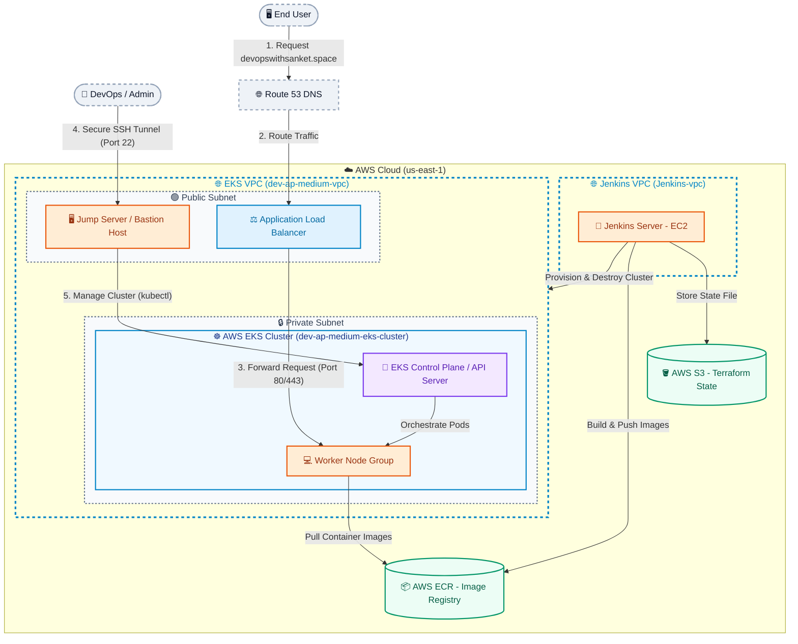
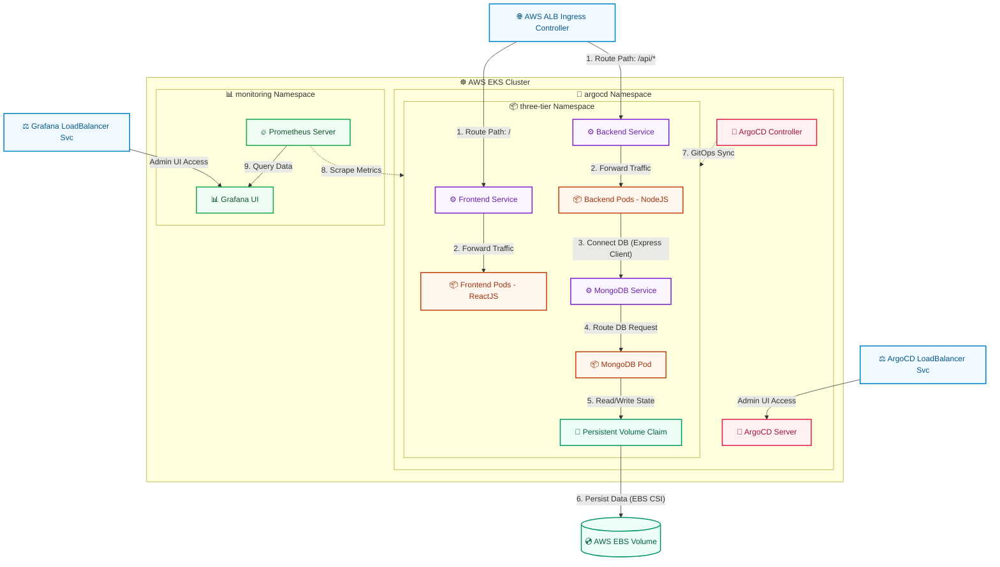

# 📐 Project Architecture & Workflow Diagrams

This page contains simple, clean, and easy-to-understand diagrams along with comprehensive workflow explanations for the **Three-Tier DevSecOps** project.

---

## ☁️ 1. AWS Architecture Diagram
Shows the high-level relationship between the user, the DevOps administrator, the custom AWS VPC, the EKS cluster, and the supporting DevOps tools.

### 📋 AWS Workflow Explanation:
1. **Domain Name System Resolution**: When the **🖥️ End User** enters the application URL (e.g., `devopswithsanket.space`), the request goes to **🌐 AWS Route 53**, which resolves the domain and directs traffic to the application's entry point.
2. **Traffic Distribution**: The request is captured by the public-facing **⚖️ AWS Application Load Balancer (ALB)** sitting inside the **🟢 Public Subnet**. The ALB decrypts SSL/TLS traffic (if configured) and forwards HTTP requests to the private worker nodes.
3. **Private Execution Environment**: The core workloads run on **💻 EC2 Worker Nodes** residing inside the **🔒 Private Subnet** within the **☸️ AWS EKS Cluster**. These nodes have no direct internet access, protecting them from direct web attacks.
4. **CI/CD Management**: The **🤖 Jenkins Server (EC2)** resides in its own VPC (**Jenkins-vpc**). It orchestrates cluster deployment and teardown using Terraform, communicating with the AWS APIs to provision the EKS VPC and its resources. Jenkins saves the configuration state files in the secure **🪣 AWS S3** bucket and pushes compiled application Docker image artifacts to **📦 AWS ECR**.
5. **Secure Administrative Entry**: Because the EKS cluster uses private API endpoints for the control plane, administrative commands cannot run from the public internet. The **👤 DevOps / Admin** must SSH into the **🖥️ Jump Server (Bastion Host)** in the Public Subnet, using it as a proxy to run `kubectl` commands against the **🧠 EKS Control Plane**.

---

## 🔄 2. CI/CD DevSecOps Workflow Diagram
Illustrates the lifecycle of a code update, showcasing the automated code-delivery pipelines and continuous security validations.

```mermaid
graph LR
    %% Developer pushing code
    Dev([💻 Developer]) -->|1. Push Code| Git[🐙 GitHub Repo]
    Git -->|2. Webhook Trigger| Jenkins[🤖 Jenkins CI/CD]

    %% Pipeline Stages
    subgraph Jenkins_Pipeline ["🛠️ Jenkins DevSecOps Pipeline"]
        direction LR
        Scan[🔍 Security Scans<br/>SonarQube, OWASP, Trivy] --> Build[🔨 Docker Build & Scan]
        Build --> Push[📤 ECR Push]
        Push --> UpdateManifest[📝 Update K8s Manifests]
    end

    %% GitOps and Deploy Flow
    Jenkins --> Scan
    UpdateManifest -->|3. Commit Tag Update| Git
    Git -->|4. Detect Change| ArgoCD[🐙 ArgoCD GitOps]
    ArgoCD -->|5. Sync & Deploy| EKS[☸️ AWS EKS Cluster]

    %% Styling
    classDef developer fill:#f8fafc,stroke:#64748b,stroke-width:2px,color:#334155;
    classDef source fill:#f0fdf4,stroke:#15803d,stroke-width:2px,color:#166534;
    classDef ci fill:#eef2f7,stroke:#475569,stroke-width:2px,color:#1e293b;
    classDef security fill:#fdf2f8,stroke:#be185d,stroke-width:2px,color:#9d174d;
    classDef docker fill:#f0f9ff,stroke:#0284c7,stroke-width:2px,color:#075985;
    classDef gitops fill:#faf5ff,stroke:#7e22ce,stroke-width:2px,color:#6b21a8;
    classDef cluster fill:#fff7ed,stroke:#c2410c,stroke-width:2px,color:#9a3412;

    class Dev developer;
    class Git source;
    class Jenkins,UpdateManifest ci;
    class Scan security;
    class Build,Push docker;
    class ArgoCD gitops;
    class EKS cluster;
```

### 📋 CI/CD Workflow Explanation:
1. **Code Commit & Webhook**: When a **💻 Developer** commits changes to the source code repo on **🐙 GitHub**, a webhook automatically triggers the matching **🤖 Jenkins** pipeline.
2. **Quality & Vulnerability Gates**:
   - **SonarQube**: Evaluates code quality, code smells, and potential security bugs. If it fails the **Quality Gate**, the pipeline halts.
   - **OWASP Dependency-Check**: Scans third-party library dependencies (npm modules) for known CVEs.
   - **Trivy Filesystem Scan**: Evaluates the local workspace files and configurations for security issues.
3. **Container Delivery**: If all source scans are successful, Jenkins builds a Docker image and pushes it to the **📦 AWS Elastic Container Registry (ECR)**. Before finalizing, **Trivy** scans the container image itself to identify OS-level package vulnerabilities.
4. **GitOps Manifest Update**: Jenkins updates the Kubernetes deployment manifests (replacing the old image tag with the new `BUILD_NUMBER`) and pushes the change to a dedicated folder/branch in the **🐙 GitHub** repository.
5. **Continuous Deployment**: **🐙 ArgoCD** monitors the manifest repository. Detecting a drift between the live EKS cluster and Git, it automatically synchronizes and deploys the new images to the **☸️ AWS EKS Cluster** using a zero-downtime rolling update strategy.

---

## ☸️ 3. Kubernetes Architecture Diagram
Displays the application components deployed inside the EKS cluster and how traffic flows through the namespaces.

### 📋 Kubernetes Namespace Workflow Explanation:
1. **Ingress & Load Balancing**:
   - Application requests are captured by the public **🌐 AWS ALB Ingress** controller, which routes `/` (frontend UI) traffic to the **⚙️ Frontend Service** and `/api/*` traffic to the **⚙️ Backend Service**.
   - Admin traffic accesses the **🧠 ArgoCD Server** UI and **📊 Grafana UI** dashboards via their respective LoadBalancer services.
2. **Frontend Presentation Tier**: The Frontend Service acts as an internal load balancer, sending traffic to the **📦 Frontend Pods** running the containerized ReactJS application.
3. **Backend Logic Tier**: The Backend Service routes API requests to the **📦 Backend Pods** running the NodeJS/Express application.
4. **Database Storage Tier**: The Backend Pods query the database through the **⚙️ MongoDB Service** (a headless service managing endpoint resolution). The query is processed by the **📦 MongoDB Pod**.
5. **State Persistence**: To prevent data loss when pods restart, MongoDB writes data to a directory backed by a **💾 Persistent Volume Claim (PVC)**. The Kubernetes cluster leverages the AWS EBS CSI driver to dynamically provision and attach a secure, high-performance **💿 AWS EBS Volume** representing persistent block storage in AWS.
6. **Continuous Delivery (GitOps)**: The **🤖 ArgoCD Controller** monitors the git manifest repository. When changes occur, it automatically synchronizes and applies the manifests directly into the `three-tier` namespace.
7. **Observability & Monitoring**: The **🔥 Prometheus Server** scrapes metrics (CPU, memory, request volume) from all namespaces (including application pods in `three-tier`). The **📊 Grafana Dashboard** queries Prometheus to display real-time cluster health and performance.
