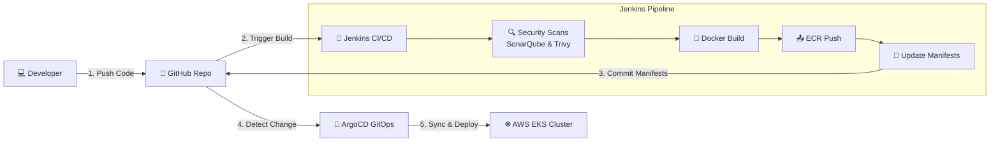
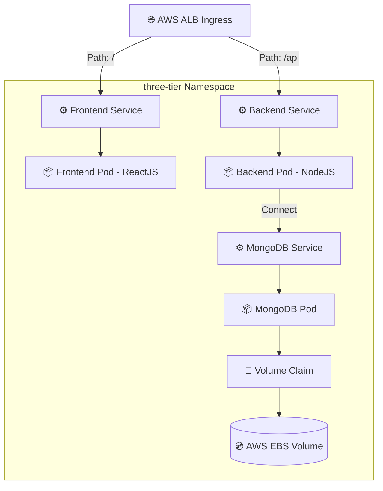

# 📐 Project Architecture & Workflow Diagrams

This page contains simple, clean, and easy-to-understand diagrams for the **Three-Tier DevSecOps** project.

---

## ☁️ 1. AWS Architecture Diagram
Shows the high-level relationship between the user, the core AWS resources, and the supporting DevOps tools.

---

## 🔄 2. CI/CD DevSecOps Workflow Diagram
Illustrates the pipeline flow from a developer's code push to the final deployment on the EKS cluster.

---

## ☸️ 3. Kubernetes Architecture Diagram
Displays the application components deployed inside the EKS cluster and how traffic flows through the namespaces.

