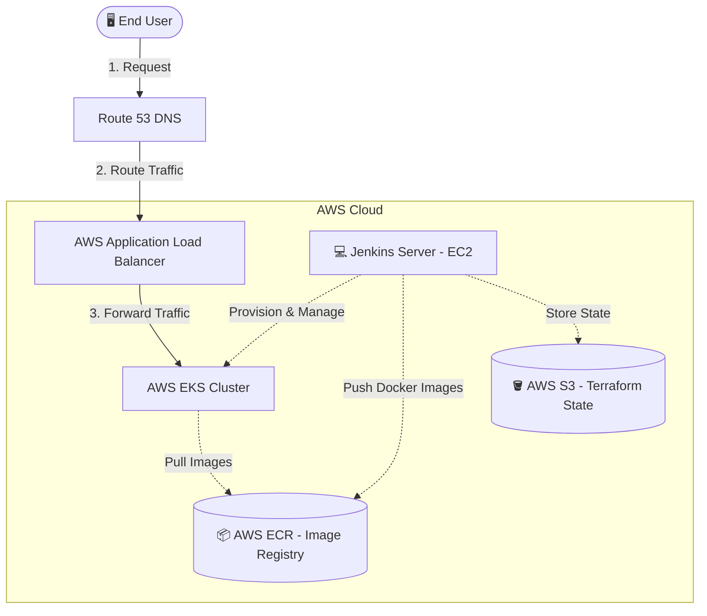
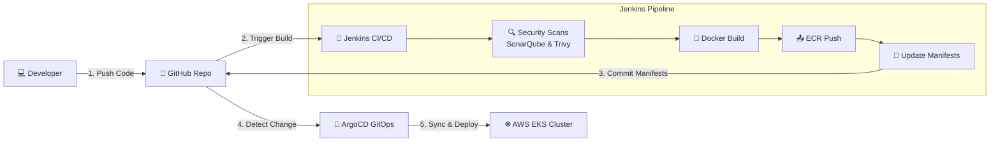
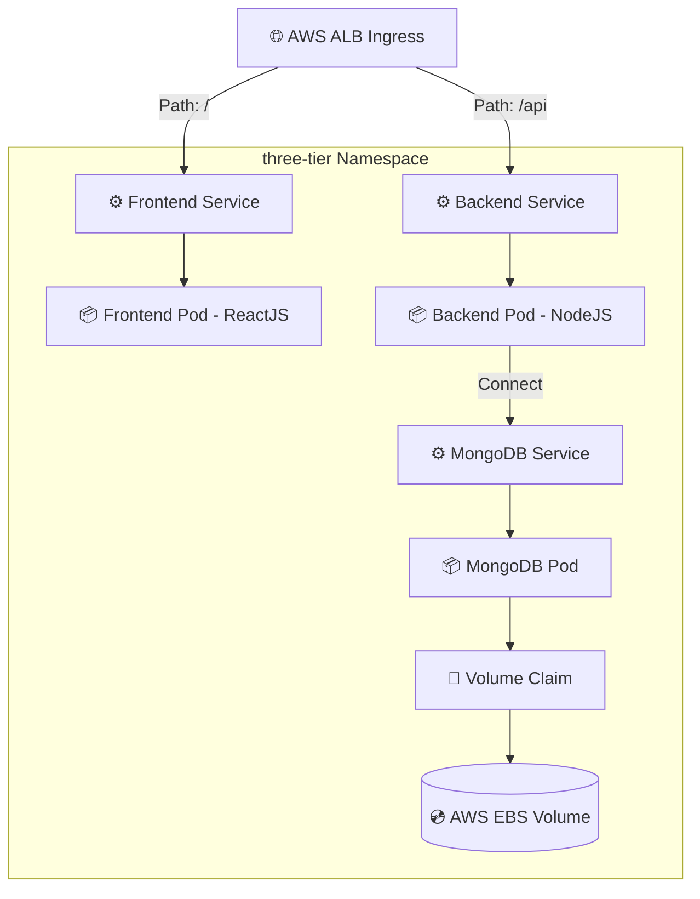

# 📐 Project Architecture & Workflow Diagrams

This page contains simple, clean, and easy-to-understand diagrams along with workflow explanations for the **Three-Tier DevSecOps** project.

---

## ☁️ 1. AWS Architecture Diagram
Shows the high-level relationship between the user, the core AWS resources, and the supporting DevOps tools.

### 📋 AWS Workflow Explanation:
1. **User Request**: The end user accesses the application. Route 53 DNS resolves the domain (`devopswithsanket.space`) and routes the traffic to the **AWS Application Load Balancer (ALB)**.
2. **Traffic Routing**: The ALB forwards the incoming user request to the **AWS EKS Cluster**.
3. **Deployment Orchestration**: The EKS worker nodes run the application workloads, pulling the necessary container images from the private **AWS ECR** registry.
4. **Infrastructure Management**: Jenkins runs on an EC2 instance, managing the cluster's lifecycle using **Terraform** (with configuration state saved in **S3**) and pushing built container images to ECR.

---

## 🔄 2. CI/CD DevSecOps Workflow Diagram
Illustrates the pipeline flow from a developer's code push to the final deployment on the EKS cluster.

### 📋 CI/CD Workflow Explanation:
1. **Developer Push**: A developer pushes code changes to the application repository on **GitHub**.
2. **Build Trigger**: GitHub sends a Webhook notification to **Jenkins** to start the CI/CD pipeline run.
3. **Security Scanning**: Jenkins runs code quality checkups via **SonarQube** and vulnerability assessments on the project filesystem using **Trivy**.
4. **Build & Push**: If scans pass, Jenkins builds the Docker images and pushes them to the **AWS ECR** private registry.
5. **GitOps Sync**: Jenkins updates the Kubernetes deployment manifests with the new image tags and pushes them back to GitHub. **ArgoCD** detects this change, pulls the new image from ECR, and triggers a rolling update on **AWS EKS** with zero downtime.

---

## ☸️ 3. Kubernetes Architecture Diagram
Displays the application components deployed inside the EKS cluster and how traffic flows through the namespaces.

### 📋 Kubernetes Namespace Workflow Explanation:
1. **Traffic Admission**: The **AWS ALB Ingress Controller** acts as the ingress traffic router, routing `/api` traffic to the Backend NodeJS application and `/` traffic to the Frontend ReactJS application.
2. **Frontend Tier**: The **Frontend Service** handles internal load-balancing for frontend traffic and routes requests to the ReactJS **Frontend Pods**.
3. **Backend Tier**: The **Backend Service** routes API requests to the NodeJS **Backend Pods**.
4. **Database Access**: The Backend Pods query the database through the **MongoDB Service**, which exposes the **MongoDB Pod**.
5. **Storage Persistence**: MongoDB mounts a **Persistent Volume Claim (PVC)**, which utilizes the AWS EBS CSI driver to persist state on a secure, external **AWS EBS Volume**.
